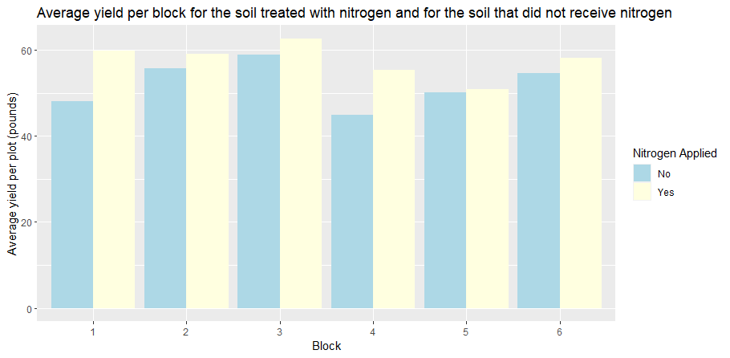

## Exercise 4

**a)** We can solve this question in this way. To randomize the distribution of soil additives over plots in such a way that each soil additive is received exactly by two plots within each block, the following steps in R can be used:

```{r,fig.width=6,fig.height=3,collapse=TRUE}
library(MASS)
set.seed(123)  # Set seed for reproducibility

# Create a matrix to store the randomized distribution of soil additives
dist_mat <- matrix(0, nrow = 6, ncol = 4)

# Randomly assign soil additives to each block
for (i in 1:6) {
  dist_mat[i, ] <- sample(c(1,1,0,0), 4)
}

# Verify that each soil additive is received by exactly two plots within each block
colSums(dist_mat)  # The sum of each column should be 2
rowSums(dist_mat)  # The sum of each row should be 2

# Combine the block information and the soil additive distribution
npk_dist <- data.frame(npk, dist_mat)
```

Within this code above, firstly we set the seed for the reproducibility after load the MASS package. Then in order to store the distribution of soil additives which is randomized, a matrix is supposed to be created. After that, we need to make verification to study if every soil additive can be received by the two plots. In the end, the data of the additive distribution information is integrated and combined.

To be more specific, we use the sample function to randomly assign soil additives to each block. We specify the probability of each soil additive with 1 = applied, 0 = not applied, using a vector of length 4 with two 1's and two 0's, which we then randomly sample from using the sample function. We repeat this process for each block, and store the resulting distribution in a matrix called `dist_mat`. We then verify that each soil additive is received by exactly two plots within each block by checking the column and row sums of `dist_mat`. Finally, we combine the block information and the soil additive distribution into a data frame called `npk_dist`.

**b)** The method of solving this question is to make a plot showing the average yield per block for the soil treated with nitrogen and for the soil that did not receive nitrogen, we can perform the following steps to realize:

```{r, fig.width=6,fig.height=3,collapse=TRUE}
library(ggplot2)
npk_dist_agg <- aggregate(yield ~ block + N, data = npk_dist, mean)
```

To begin with, we can calculate the average yield per block for the soil treated with nitrogen and for the soil that did not receive nitrogen by using `npk_dist_agg` with `aggregate()`.

```{r, fig.width=6,fig.height=3,collapse=TRUE}
ggplot(npk_dist_agg, aes(x = block, y = yield, fill = factor(N))) +
  geom_col(position = "dodge") +
  geom_bar(stat = "identity", position = "dodge") +
  scale_fill_discrete(name = "N") +
  labs(x = "Block", y = "Average yield per plot (pounds)", fill = "Nitrogen Applied") +
  scale_fill_manual(values = c("lightblue", "lightyellow"), labels = c("No", "Yes")) +
  ggtitle("Average yield per block for the soil treated with nitrogen and for the soil that did not receive nitrogen")
```

After calculating the average data, we start to make a plot to realize the same target. This plot is to show the average yield per block for the soil treated with nitrogen and for the soil that did not receive nitrogen.



Basically, we use the aggregate function to calculate the average yield per block for the soil treated with nitrogen which is `N = 1` and for the soil that did not receive nitrogen which is `N = 0`. We then use the `ggplot2` package to make a grouped bar chart showing the average yield per block for the two groups, with the `x-axis` representing the block and the `y-axis` representing the average yield per plot in pounds. The fill argument is used to group the bars by whether or not nitrogen was applied, and the position argument is used to place the side of the bars by side. We also add appropriate axis labels, a title of "Average yield per block for the soil treated with nitrogen and for the soil that did not receive nitrogen", and a legend. What's more, we define adequate colours for the plot.

The purpose of taking the factor block into account is to control for any variability in yield that may be due to the location of the plots within each block. By comparing the average yield per block between the two groups `N = 1` and `N = 0`, we can see whether there is a difference in yield that is due to the application of nitrogen or to other factors, such as differences in soil conditions or weather.

**c)** For this question, we conduct a full two-way ANOVA model with the response variable yield and the two factors block and N as follows. To realize this, we use the `aov` function in R. To begin with, we load the required `npk` dataset from the MASS package and then make the structure of the data.

```{r, fig.width=6,fig.height=3,collapse=TRUE}
library(MASS)
data(npk)
str(npk)
```

From the output, we know that the dataset has 24 observations on 4 variables: `block`, `N`, `P`, and `K`. The response variable is yield, which is measured in pounds per plot. The block variable is a factor variable with 6 levels, indicating the block in which the plot was located. The `N`, `P`, and `K` variables are binary variables indicating whether nitrogen, phosphate, or potassium was applied to the plot.

```{r, fig.width=6,fig.height=3,collapse=TRUE}
npk_anova_model <- aov(yield ~ block + N, data = npk)
summary(npk_anova_model)
```

The output shows the results of the ANOVA. We can see that both the`block` and `N` variables have significant effects on yield `p` \< 0.05. This indicates that both the location of the plot and the application of nitrogen have an impact on the yield of peas. We use the `aov` function to fit a full two-way ANOVA model with the response variable yield and the two factors `block` and `N`. We then use the summary function to view the results of the ANOVA, including the `F-statistic`, `p-value`, and degree of freedom for each factor and their interaction. The Friedman test is not suitable for this situation because the Friedman test is a non-parametric test that is used to compare three or more related groups, and assumes that the data are measured on an ordinal scale. In this case, we have two factors `block` and `N` that are not related, and the response variable `yield` is measured on a continuous scale. Therefore, the assumptions of the Friedman test are not met, and it is not appropriate to use this test for this analysis.

It is sensible and adequate to include the factor block in this model because the block factor represents a grouping variable that is not of primary interest, but that may have an effect on the response variable. By including the block factor in the model, we can control for any variability in yield that is due to the location of the plots within each block, and thus increase the power of the analysis to detect the effect of the `N` factor on yield.

**d)** This question requires me to give my favorite model and it depends on my choice. To investigate other possible models with all the factors combined, we can use the function to fit a linear regression model. Here are two possible models with one pairwise interaction term:`lm`.

The Model 1 includes the interaction between N and block and the Model 2 includes the interaction between P and block.

```{r, fig.width=6,fig.height=3,collapse=TRUE}
npk_model1 <- lm(yield ~ N*block + P + K, data = npk_dist)
summary(npk_model1)
npk_model2 <- lm(yield ~ P*block + N + K, data = npk_dist)
summary(npk_model2)
```

We include the interaction between `N` and `block` in the first model, while in the second model, we include the interaction between `P` and `block`. We also include the main effects of all three soil additives `N`, `P`, `K` and the `block` factor. To test for the presence of main effects of `N`, `P`, and `K`, we can use an ANOVA table to compare the two models with and without the corresponding main effect.

```{r, fig.width=6,fig.height=3,collapse=TRUE}
npk_model_noN <- lm(yield ~ block + P + K, data = npk_dist)
anova(npk_model_noN, npk_model1)

```

To begin with, we make the model without the main effect of N and after that we compare models with and without the main effect of `N`. Similarly, we can test for the main effects of `P` and `K` by comparing the models with and without the corresponding main effect.

Model 1 would be my favorite choice for this given situation, which includes the interaction between `N` and `block`. This model assumes that the effect of `N` on yield may depend on the block where the plot is located. The main effect of `N` is also included, allowing us to test whether `N` has a significant effect on yield, regardless of the `block`. The main effects of `P` and `K` are also included, controlling for any potential effects of these soil additives on yield. I prefer this model because it allows for more flexibility in modeling the relationship between the response variable and the soil additive `N`, which is the factor of primary interest.

**e)** This question mains to perform a mixed effects analysis, we will use the `lmer` function in the R package `lme4`. This function allows us to model the `block` variable as a random effect. Firstly we load the lme4 package. and get a mixed affects model with `block` as a random affect.

```{r, fig.width=6,fig.height=3,collapse=TRUE}
library(lme4)
npk_mixed <- lmer(yield ~ N + P + K + (1|block), data = npk_dist)
summary(npk_mixed)

```

It is obvious the we treat block as a random effect in this code above, allowing for differences in the intercept among the blocks. We include the main effects of all three soil additives: `N`, `P`, and `K` as fixed effects.

Comparing the results from the mixed effects model to the results from the full two-way ANOVA model in the third question, we can see that the estimates of the fixed effects including `N`, `P`, and `K` are similar in both models, but the standard errors and `p-values` are slightly different. The mixed effects model assumes that the variance of the yield response may differ among the blocks, which leads to a larger estimate of the residual variance and smaller p-values for the fixed effects.

Overall, both models suggest that the soil additive has a significant effect on yield. However, the mixed effects model provides a more appropriate way to model the data, by taking into account the variation in yield among the blocks.
